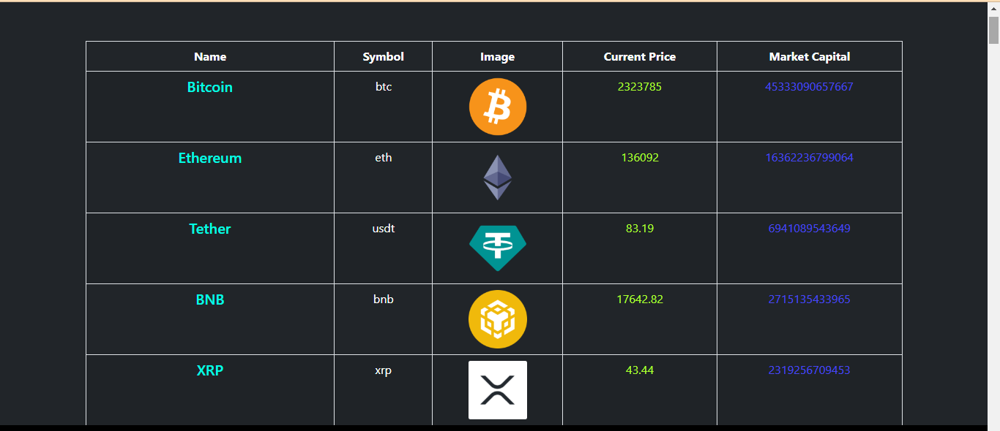
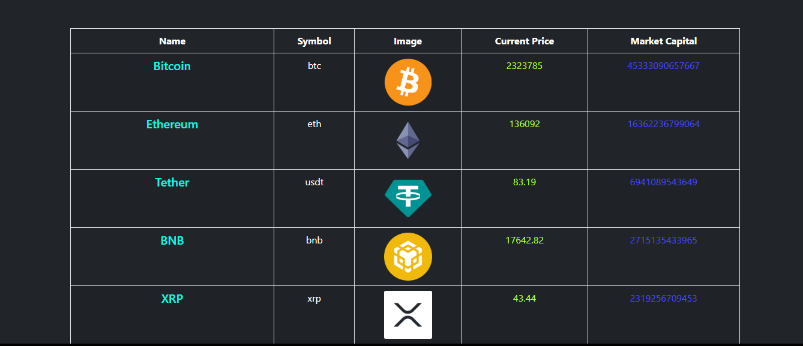

# Django-Live-CrptoCurrency-Price


# Crypto Price Tracker

A Django-based live cryptocurrency price tracking website.




## Features

List the main features and functionalities of your website, such as:

- Real-time cryptocurrency price marketcap
- All Crpto coins Price
- Coingecko api
-cryptocurrencies Live marketcap


### Prerequisites

python 3
Django

### Installation

Step-by-step instructions on how to install and set up your Django app.

```bash
# Clone the repository
git clone https://github.com/yourusername/crypto-price-tracker.git

# Change directory to the project folder
cd crypto-price-tracker

# Create a virtual environment (optional but recommended)
python -m venv venv

# Activate the virtual environment
# On Windows:
venv\Scripts\activate
# On macOS and Linux:
source venv/bin/activate

# Install project dependencies
pip install -r requirements.txt

# Apply database migrations
python manage.py migrate

# Create a superuser (for admin access)
python manage.py createsuperuser

# Run the development server
python manage.py runserver
